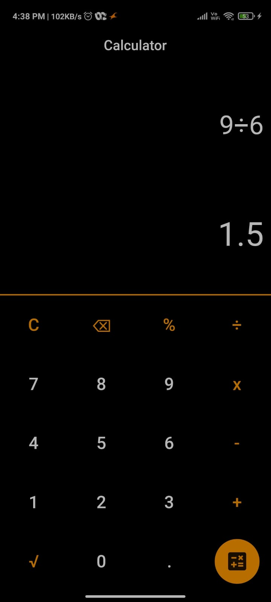

# Calculator

Assignment for TCC-Intro-to-AppDev

## First App
This is a calculator app developed by me. Its a basic calculator with all the basic functionalities like addition, subtraction, divide, square root etc.

### Dividing

### Square Root

### Addition and Subtraction in an expression

# Thank you for guiding me thorough this assignment!
### I learned a lot during this assignment. Hoping to work more on such assignments!
